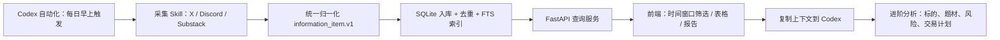

# 量化交易信息系统前后端分离架构文档

## 1. 系统目标

这套系统服务于每日盘前交易决策，核心不是自动下单，而是把高质量信息源变成可查询、可追溯、可分析的本地情报库。

系统分为三层：

1. 数据采集层：每天早上自动采集 X、Discord、Substack 等信息源。
2. 数据服务层：把采集数据标准化入库，提供快速查询、筛选、上下文组装。
3. 前端分析层：展示盘前日报、信息源表格、标的聚合观点，并支持单条数据复制上下文到 Codex 做进阶分析。

## 2. 技术选型建议

### 前端

建议使用：

- Vite + React + TypeScript
- TanStack Query：请求和缓存后端数据
- TanStack Table：表格筛选、排序、分页
- Zustand：本地筛选状态
- shadcn/ui 或轻量自定义组件：表格、弹窗、按钮、标签

第一版可以不用复杂图表库，先把信息密度和交互效率做好。

### 后端

建议使用：

- FastAPI + Python
- SQLite 本地数据库
- FTS5 全文搜索
- APScheduler 可选，仅用于本地开发；正式定时使用 Codex 自动化
- Pydantic：API 请求/响应模型

为什么 SQLite：当前是个人本地研究系统，SQLite 查询快、部署简单、能做 FTS、方便备份。后面数据量大了再迁移 Postgres。

## 3. 推荐项目目录

```text
quant-trading-intel/
  apps/
    web/
      src/
        app/
        components/
        pages/
        api/
        stores/
        types/
      package.json
      vite.config.ts
    api/
      app/
        main.py
        api/
          routes_items.py
          routes_reports.py
          routes_context.py
          routes_runs.py
        core/
          config.py
          db.py
        services/
          ingestion_service.py
          report_service.py
          context_service.py
          search_service.py
        models/
          schemas.py
      pyproject.toml
  packages/
    shared/
      report_contract.v1.json
      information_item.v1.schema.json
  data/
    quant_intel.sqlite
    raw/
    exports/
  automations/
    premarket_collection_prompt.md
  docs/
    frontend_backend_architecture.md
    api_contract.md
    database_schema.md
```

## 4. 数据流



## 5. 前端功能设计

### 5.1 页面结构

第一版前端建议 4 个页面：

1. 盘前日报页 `/reports/premarket`
2. 信息库查询页 `/items`
3. 标的详情页 `/tickers/:ticker`
4. 采集运行状态页 `/runs`

### 5.2 盘前日报页

用于替代当前静态 HTML，结构包括：

- 顶部总览：日期、数据窗口、来源数、条目数、大盘方向
- 基本面分析：大盘/题材方向、证据、原文、风险
- 按信息源分组表格：Edgerunner、好吃、Serenity 等
- 按标的聚合观点：MU、MRVL、AVGO、NBIS 等
- 标的历史观点串联：同一标的多日期观点
- 数据质量：缺失源、采集失败、部分采集提醒

### 5.3 时间窗口筛选

用户目标：指定任意时间窗口，得到对应范围的数据和报告。

前端控件：

- 快捷按钮：`今天`、`近 24 小时`、`近 3 天`、`近 7 天`
- 自定义时间：开始时间、结束时间
- 时区选择：默认 `Asia/Shanghai`
- 来源过滤：X、Discord、Substack
- 作者过滤：好吃、Edgerunner、Serenity
- 标的过滤：MU、MRVL、AVGO 等
- 题材过滤：AI 半导体、Memory、Photonics、宏观流动性等

前端状态结构：

```ts
type TimeWindowFilter = {
  startAt: string;
  endAt: string;
  timezone: "Asia/Shanghai" | "America/New_York" | "UTC";
  preset?: "today" | "24h" | "3d" | "7d" | "custom";
};

type ItemFilters = {
  timeWindow: TimeWindowFilter;
  sourceTypes: Array<"x" | "discord" | "substack">;
  sourceIds: string[];
  authors: string[];
  tickers: string[];
  themes: string[];
  sentiment?: "看涨" | "看跌" | "中性" | "观望";
  query?: string;
};
```

交互逻辑：

1. 用户选择时间窗口。
2. 前端请求 `/api/items?start_at=...&end_at=...`。
3. 后端按 `timestamps.created_at` 查询。
4. 前端刷新信息表格、聚合统计、报告摘要。

注意：时间筛选必须基于“信息发布时间”，不是采集时间。字段使用 `items.created_at`。

### 5.4 数据进阶分析

用户目标：针对某一条信息点击“进阶分析”，复制其数据库关联信息和上下文，然后粘贴到 Codex，让 Codex 做更深分析。

前端交互：

1. 每条信息右侧有 `分析` 按钮。
2. 点击后打开侧边栏。
3. 侧边栏展示：
   - 当前原文
   - 作者信息
   - 来源链接
   - 相关标的
   - 同作者前后文
   - 同标的近 N 条信息
   - 同题材近 N 条信息
   - 原始 JSON 摘要
4. 用户点击 `复制给 Codex`。
5. 前端调用 `/api/context/item/{item_id}` 获取上下文包，并复制到剪贴板。

复制内容建议格式：

```markdown
# 数据进阶分析请求

请基于以下本地数据库上下文，分析这条信息对盘前交易的意义：

## 当前信息
- item_id: itm_xxx
- 发布时间: 2026-06-19T13:11:12Z
- 来源: X @aleabitoreddit
- 作者: Serenity
- 链接: https://x.com/...
- 标的: LPK
- 原文:
> Wow, I completely missed this with $LPK meeting notes...

## 数据库关联上下文

### 同作者近 10 条
...

### 同标的近 10 条
...

### 同题材近 10 条
...

### 已有系统判断
- 题材: 先进封装/玻璃基板
- 初步观点: 看涨
- 风险: 小票/海外标的流动性和信息真实性要验证

## 希望你输出
1. 这条信息是否构成交易信号
2. 看涨/看跌/中性
3. 证据链
4. 风险和反证
5. 如果纳入盘前日报，应该放在哪个题材和标的下
```

### 5.5 信息列表字段

列表建议字段：

| 字段 | 说明 |
|---|---|
| 发布时间 | `created_at`，主排序字段 |
| 来源 | X / Discord / Substack |
| 作者 | handle/display_name |
| 题材 | 分析层生成 |
| 标的 | ticker entities |
| 观点 | 看涨/看跌/中性/观望 |
| 原文摘要 | content.text 前 200 字 |
| 互动指标 | X likes/views 等 |
| 数据质量 | 是否 partial、是否 inferred |
| 操作 | 查看、分析、复制、打开原文 |

## 6. 后端功能设计

### 6.1 后端职责

后端不负责下单，只负责：

1. 接收或执行采集任务。
2. 归一化数据。
3. 入库和去重。
4. 查询和全文搜索。
5. 生成报告数据。
6. 组装单条信息的进阶分析上下文。

### 6.2 API 设计

#### 查询信息

```http
GET /api/items
```

参数：

| 参数 | 说明 |
|---|---|
| start_at | 发布时间起点 |
| end_at | 发布时间终点 |
| source_type | x/discord/substack |
| source_id | 具体来源 |
| author | 作者 |
| ticker | 标的 |
| theme | 题材 |
| sentiment | 看涨/看跌/中性/观望 |
| q | 全文搜索 |
| limit | 默认 100 |
| offset | 分页 |

返回：

```json
{
  "items": [],
  "total": 122,
  "limit": 100,
  "offset": 0
}
```

#### 获取单条信息详情

```http
GET /api/items/{item_id}
```

返回完整 `information_item.v1` 加分析字段。

#### 获取进阶分析上下文

```http
GET /api/context/item/{item_id}
```

参数：

| 参数 | 说明 |
|---|---|
| author_context_limit | 默认 10 |
| ticker_context_limit | 默认 10 |
| theme_context_limit | 默认 10 |
| format | markdown/json，默认 markdown |

返回：

```json
{
  "item_id": "itm_xxx",
  "format": "markdown",
  "copy_text": "...",
  "context": {
    "current_item": {},
    "same_author_items": [],
    "same_ticker_items": [],
    "same_theme_items": []
  }
}
```

#### 获取盘前日报

```http
GET /api/reports/premarket
```

参数：

| 参数 | 说明 |
|---|---|
| report_date | 日期 |
| start_at | 可选，覆盖默认窗口 |
| end_at | 可选 |
| tickers | 可选 watchlist |

返回 `premarket_report.v1`。

#### 触发采集

```http
POST /api/ingestion/run
```

请求：

```json
{
  "mode": "premarket",
  "sources": ["x", "discord", "substack"],
  "window": {
    "start_at": "2026-06-20T00:00:00+08:00",
    "end_at": "2026-06-20T08:30:00+08:00"
  }
}
```

#### 查看采集运行

```http
GET /api/runs
GET /api/runs/{run_id}
```

## 7. 数据库设计

第一版 SQLite 表：

### ingestion_runs

记录每次采集任务。

```sql
CREATE TABLE ingestion_runs (
  id TEXT PRIMARY KEY,
  mode TEXT NOT NULL,
  status TEXT NOT NULL,
  started_at TEXT NOT NULL,
  finished_at TEXT,
  source_count INTEGER DEFAULT 0,
  item_count INTEGER DEFAULT 0,
  error_count INTEGER DEFAULT 0,
  summary_json TEXT
);
```

### information_items

核心原始信息表。

```sql
CREATE TABLE information_items (
  id TEXT PRIMARY KEY,
  schema_version TEXT NOT NULL,
  source_type TEXT NOT NULL,
  source_id TEXT NOT NULL,
  source_name TEXT,
  collector TEXT,
  external_id TEXT,
  external_url TEXT,
  author_handle TEXT,
  author_display_name TEXT,
  title TEXT,
  content_text TEXT,
  content_hash TEXT NOT NULL,
  language TEXT,
  created_at TEXT NOT NULL,
  collected_at TEXT NOT NULL,
  raw_json TEXT NOT NULL,
  run_id TEXT,
  created_date TEXT GENERATED ALWAYS AS (substr(created_at, 1, 10)) VIRTUAL
);

CREATE INDEX idx_items_created_at ON information_items(created_at);
CREATE INDEX idx_items_source_created ON information_items(source_id, created_at);
CREATE INDEX idx_items_author_created ON information_items(author_handle, created_at);
CREATE UNIQUE INDEX idx_items_external_unique ON information_items(source_type, external_id);
CREATE UNIQUE INDEX idx_items_hash_unique ON information_items(source_id, content_hash, created_at);
```

### item_entities

标的、人物、机构等实体。

```sql
CREATE TABLE item_entities (
  id INTEGER PRIMARY KEY AUTOINCREMENT,
  item_id TEXT NOT NULL,
  entity_type TEXT NOT NULL,
  value TEXT NOT NULL,
  normalized_value TEXT NOT NULL,
  confidence REAL DEFAULT 1.0,
  source TEXT,
  metadata_json TEXT,
  FOREIGN KEY(item_id) REFERENCES information_items(id)
);

CREATE INDEX idx_entities_value ON item_entities(entity_type, normalized_value);
```

### item_analysis

分析结果表，存日报分析、情绪、题材等。

```sql
CREATE TABLE item_analysis (
  item_id TEXT PRIMARY KEY,
  theme TEXT,
  sentiment TEXT,
  view_label TEXT,
  reason TEXT,
  risk TEXT,
  quote TEXT,
  specific_tickers_json TEXT,
  confidence REAL,
  model_name TEXT,
  analyzed_at TEXT,
  analysis_json TEXT,
  FOREIGN KEY(item_id) REFERENCES information_items(id)
);
```

### report_snapshots

保存每日日报快照。

```sql
CREATE TABLE report_snapshots (
  id TEXT PRIMARY KEY,
  report_type TEXT NOT NULL,
  report_date TEXT NOT NULL,
  start_at TEXT NOT NULL,
  end_at TEXT NOT NULL,
  generated_at TEXT NOT NULL,
  report_json TEXT NOT NULL,
  report_html TEXT,
  item_count INTEGER DEFAULT 0
);
```

### FTS 全文搜索

```sql
CREATE VIRTUAL TABLE information_items_fts USING fts5(
  item_id UNINDEXED,
  title,
  content_text,
  author_handle,
  source_name
);
```

## 8. 每日自动化采集设计

### 8.1 Codex 自动化职责

使用 Codex automation 每天早上定时执行一个任务：

1. 运行采集脚本。
2. 把采集结果归一化成 `information_item.v1`。
3. 写入 SQLite。
4. 生成日报快照。
5. 输出运行摘要。

建议时间：

- 北京时间 20:30 或 21:00：适合美股盘前。
- 如果你说的“每天早上”是中国早上，用北京时间 07:30；但对美股盘前，应使用开盘前 1-2 小时。

### 8.2 自动化 Prompt 草案

```text
每天按计划运行美股盘前信息采集：

1. 在工作区运行后端采集入口。
2. 采集 X、Discord、Substack 高质量信息源。
3. 采集窗口默认为过去 24 小时；周一可扩大到过去 72 小时。
4. 将数据归一化为 information_item.v1。
5. 写入本地 SQLite：data/quant_intel.sqlite。
6. 生成当天 premarket_report.v1 快照。
7. 输出采集摘要：每个来源数量、失败来源、最新时间、数据库路径、报告路径。
8. 如果某个来源失败，不要中断其他来源；记录错误。
```

### 8.3 采集入口命令

后端建议提供命令：

```bash
cd apps/api
python -m app.jobs.collect_premarket \
  --db ../../data/quant_intel.sqlite \
  --window 24h \
  --config ../../configs/premarket.sources.json
```

### 8.4 与现有调度层的关系

当前已有 `outputs/information_ingestion` 的调度层，可以直接复用为后端采集服务的内核：

- 保留 `information_item.v1`
- 保留 SQLite 去重思路
- 增加 Discord adapter
- 增加入库接口
- 增加 report snapshot 生成
- 增加 API 查询层

## 9. 进阶分析上下文组装逻辑

当用户点击某条信息分析时，后端按以下顺序组装上下文：

1. 当前 item 完整信息。
2. 同作者最近 10 条。
3. 当前 item 涉及 ticker 的最近 10 条。
4. 当前 item 所属 theme 的最近 10 条。
5. 同 source thread 或 Discord channel 的前后文。
6. 该 ticker 在最近日报中的观点历史。
7. 数据质量说明。

上下文大小控制：

- 默认 4,000-8,000 字，适合复制给 Codex。
- 超过限制时优先保留当前原文、同标的、同作者高信号内容。
- 原始长文只取摘要和关键句，保留链接。

## 10. 第一阶段实施顺序

建议分 5 步走：

1. 建库：把当前 `high_quality_items.jsonl` 导入 SQLite。
2. 后端：实现 `/api/items`、`/api/context/item/{id}`、`/api/reports/premarket`。
3. 前端：实现信息库查询页和时间窗口筛选。
4. 前端：实现单条数据侧边栏和“复制给 Codex”。
5. 自动化：创建 Codex 每日采集任务，写入数据库并生成日报快照。

## 11. 验收标准

### 前端

- 能选择任意时间窗口并刷新表格。
- 能按来源、作者、标的、题材筛选。
- 能点击单条信息查看详情。
- 能一键复制进阶分析上下文。
- 能打开来源原文链接。

### 后端

- 每日采集能独立运行。
- 单个来源失败不影响其他来源。
- 数据入库可去重。
- 1000-10000 条数据下查询保持秒级。
- `created_at` 时间筛选准确。
- 能生成 `premarket_report.v1`。

### 自动化

- 每天定时运行。
- 运行结果可在 `/api/runs` 查看。
- 失败时记录错误和最后成功时间。
- 不静默漏数。
